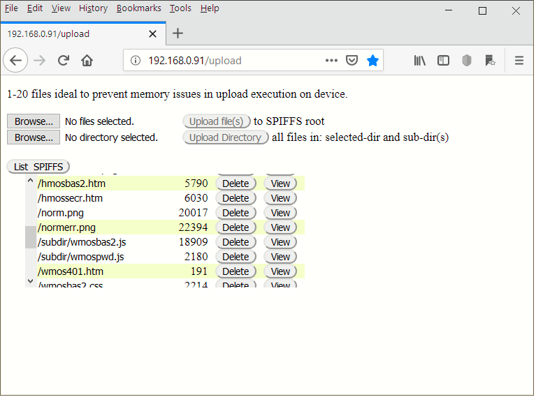

# SPIFFS-DevFsUpload

Please use DaveBrad/DevFsUploadESP instead.

A Arduino library  that provides a browser GUI to upload/delete file(s) to SPIFFS and webpage devices (eg. ESP8266)

This library provides a ESP8266 development tool to upload file(s) to
an ESP8266 module that has SPIFFS included. The tool works through
a webpage to: 
   - 'browse' to file(s) on a PC, 'upload' the file/files
   - 'browse' to directory on a PC, 'upload' the file/files 
     and/or sub-directories file(s) too
to the ESP8266. 

Additional capabilities:
   - 'List' files on ESP8266, 
   - 'delete' a file, and
   - 'view' a file into a HTML textarea (text based)
   
NOTE/WARNING: there is no checking for free space on the ESP8266 when uploading files.

